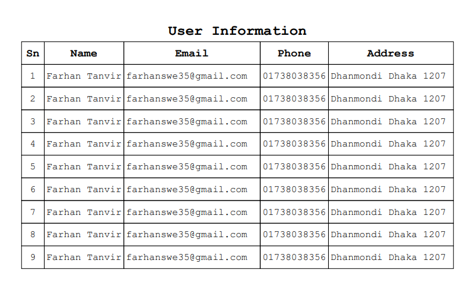

# laravel-fpdf

<p align="center">
     <a href="https://github.com/apphostbd/laravel-fpdf/tags" alt="tag">
        
      </a> 
     <a href="https://packagist.org/packages/apphostbd/laravel-fpdf" alt="Total Downloads">
        
      </a> 
     <a href="https://github.com/apphostbd/laravel-fpdf/issues" alt="Issues">
        
      </a>  
     <a href="https://github.com/apphostbd/laravel-fpdf/fork" alt="Forks">
        
      </a>  
     <a href="https://github.com/apphostbd/laravel-fpdf/stargazers" alt="Stars">
        
      </a>  
     <a href="https://github.com/apphostbd/laravel-fpdf/blob/master/LICENSE" alt="License">
        
      </a>       
</p>


FPDF is a PHP class which allows to generate PDF files with pure PHP, that is to say without using the PDFlib library. F from FPDF stands for Free: you may use it for any kind of usage and modify it to suit your needs..

## Installation Composer
```sh
  composer require apphostbd/laravel-fpdf
```
### Laravel >= 5.5
Enjoy the auto discovery feature. 

### Laravel <5.5
`config/app.php`

```php

// config/app.php

return [
    'aliases' => [
        'Fpdf' => AppHostBD\Fpdf\Facades\FpdfFacade::class,
     ]

```

## Basic Tutorial

### Route Page example
     
```php
     Route::get('/', function () {
         Fpdf::AddPage();
         Fpdf::SetFont('Courier', 'B', 18);
         Fpdf::Cell(50, 25, 'Hello World!');
         Fpdf::Output();
         exit();
     });

```
### Controller Page example

```php
namespace App\Http\Controllers;

use Fpdf;

class TestController extends Controller
{
    public function test(){
        Fpdf::AddPage();
        Fpdf::SetFont('Courier', 'B', 18);
        Fpdf::Cell(50, 25, 'Hello World!');
        Fpdf::Output();
        exit;
    }

}


```

### Blade Page example

```php
namespace App\Http\Controllers;


//use Fpdf;

class TestController extends Controller
{
    public function testView(){
        return view('test');
    }
}   
```
Blade Page Path: view/test.blade.php 

```php
// test.blade.php
<?php
Fpdf::AddPage();
Fpdf::SetFont('Courier', 'B', 18);
Fpdf::Cell(50, 25, 'Hello World!');
Fpdf::Output();
exit();

```

## Basic example
### Example 1
```php
Fpdf::AddPage();

// SetFont( Font Name['Courier','Arial'], Font Style['','B','I','U'], Font Size )
// Font style empty string: regular, B: bold, I: italic, U: underline
Fpdf::SetFont('Courier', 'B', 18);          

// Title or Header Page cell( Cell width, Cell height, String text value, border[0,1], Indicates [0,1,3], Text align['L','C','R'] )
// Text align L or empty string, C: center, R: right align
Fpdf::Cell(190, 10, 'User Information',0,1,'C');

Fpdf::SetFont('Courier', 'B', 14);

Fpdf::Cell(10, 10, 'Sn',1,0,'C');
Fpdf::Cell(35, 10, 'Name',1,0,'C');
Fpdf::Cell(60, 10, 'Email',1,0,'C');
Fpdf::Cell(30, 10, 'Phone',1,0,'C');
Fpdf::Cell(55, 10, 'Address',1,1,'C');

Fpdf::SetFont('Courier', '', 12);
for($i=1;$i<10;$i++){
    Fpdf::Cell(10, 10, $i,1,0,'C');
    Fpdf::Cell(35, 10, 'Farhan Tanvir',1,0,'L');
    Fpdf::Cell(60, 10, 'farhanswe35@gmail.com',1,0,'L');
    Fpdf::Cell(30, 10, '01738038356',1,0,'L');
    Fpdf::Cell(55, 10, 'Dhanmondi Dhaka 1207',1,1,'L');
}

Fpdf::Output();
exit();

```

Out put Example 1 click here [Example 1 pdf](https://github.com/apphostbd/laravel-fpdf/raw/master/src/Fpdf/demo/pdf/example1.pdf "Example 1 pdf")

Screenshot PDF



